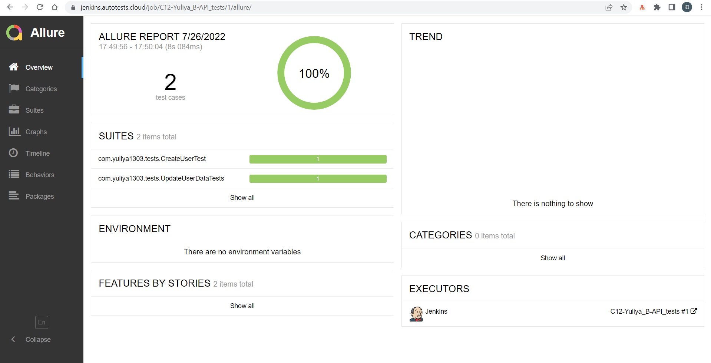

# Автоматизации тестирования API https://reqres.in/
## :link: <a target="_blank" href="https://reqres.in/">https://reqres.in/ - тестовый веб ресурс</a>

## :page_with_curl: Содержание:

- <a href="#computer-сode_stack">Технологии и инструменты</a>
- <a href="#clipboard-реализованные-проверки">Реализованные проверки</a>
- <a href="#robot-сборки-в-Jenkins">Сборка в Jenkins</a>
- <a href="#keyboard-запуск-из-терминала">Запуск из терминала</a>
- <a href="#bar_chart-allure-отчет">Allure отчет</a>

## :computer: Технологии и инструменты
<p align="left">


</p>

## :clipboard: Реализованные проверки
- Проверка созда юзерания :heavy_check_mark:
- Проверка обновления данных юзера :heavy_check_mark:

## :robot: Сборка в Jenkins
### <a target="_blank" href="https://jenkins.autotests.cloud/job/C12-Yuliya_B-API_tests/">Cборка в Jenkins</a>
<p align="center">

</p>

## :keyboard: Запуск из терминала
Локальный запуск всех тестов:
```
gradle clean test
```
Удаленный запуск всех тестов:
```
clean test
```
  
## :bar_chart: Allure отчет
- ### Главный экран отчета
<p align="center">

</p>

- ### Страница с проведенными тестами
<p align="center">

</p>
